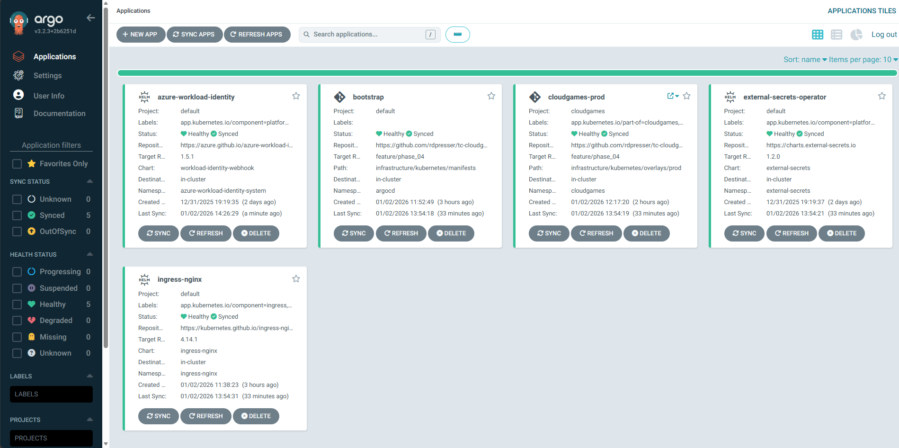
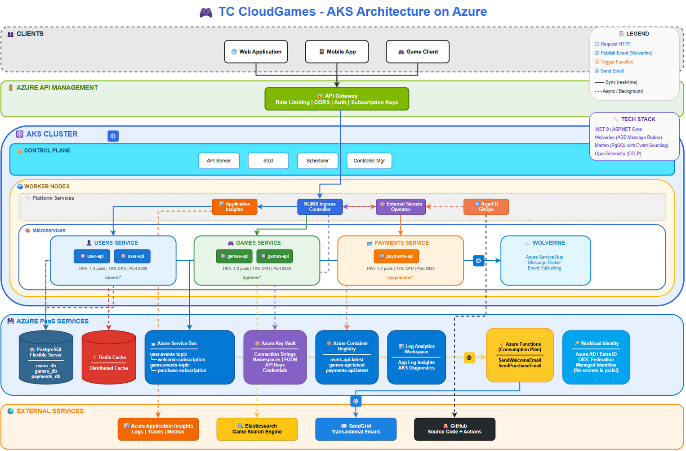

# TC Cloud Games - Microservices Solution

A cloud-native gaming platform built with microservices architecture, Azure infrastructure (AKS, Service Bus, Key Vault, PostgreSQL, Redis), event-driven communication with Wolverine, Event Sourcing with Marten, and GitOps deployment with ArgoCD.

## 📁 Repository Structure

```
tc-cloudgames-solution/
├── 🛠️ infrastructure/
│   ├── terraform/          # IaC: AKS, ACR, Key Vault, Service Bus, PostgreSQL, Redis
│   └── kubernetes/         # K8s manifests: base/, overlays/, ArgoCD applications
├── 🚀 orchestration/
│   ├── apphost/            # .NET Aspire AppHost (local dev: all services + dependencies)
│   └── functions/          # Azure Functions for serverless operations
├── 📈 k6/                   # Smoke, load, and performance test harness for AKS endpoints
├── 🎯 services/
│   ├── users/              # User management, auth, RBAC (Event Sourcing)
│   ├── games/              # Game catalog, library, purchase (CQRS)
│   └── payments/           # Payment processing, transactions (CQRS + Outbox)
├── 🧱 shared/
│   └── common/             # Contracts, integration events, Wolverine configuration
├── 📚 docs/                # Architecture diagrams and documentation
├── 🔄 .github/
│   └── workflows/          # GitHub Actions CI/CD pipelines
└── 📜 scripts/
    └── clone-repos.ps1     # Multi-repo setup script
```

---

## 🔧 Technology Stack

### Backend & API
- **.NET 9** - Main development framework
- **FastEndpoints** - High-performance, minimal HTTP endpoints
- **FluentValidation** - Input validation with FastEndpoints integration

### Data & Persistence
- **Marten** - Event Store and document database on PostgreSQL
- **PostgreSQL** - Relational database (schema-per-service, no shared databases)
- **Redis** - Distributed caching and session storage

### Event-Driven Architecture
- **Wolverine** - Message broker with CQRS, Outbox pattern, and saga support
- **Azure Service Bus** - Production messaging (topics, subscriptions, DLQ)
- **RabbitMQ** - Local development messaging

### Infrastructure & Deployment
- **Azure Kubernetes Service (AKS)** - Production Kubernetes cluster
- **Azure Container Registry (ACR)** - Container image storage
- **Azure Key Vault** - Secrets and configuration management
- **Azure Service Bus** - Messaging and event distribution
- **Terraform 1.14.x** - Infrastructure as Code
- **Docker** - Container images

### K6 Test Suites
- **Smoke (1 VU)**: fast sanity/health check
- **Load (25 VU)**: steady-state expected traffic
- **Performance (50 or 100 VU)**: breakpoint/stress to find limits

**Examples (PowerShell, timestamped outputs under `k6/output/`):**
- Smoke (1 VU): `$runId=$(Get-Date -Format 'yyyyMMdd_HHmmss'); k6 run -e RUN_ID=$runId --summary-export k6/output/users-smoke_$runId.json k6/smoke/users-smoke.js`
- Load (25 VU): `$runId=$(Get-Date -Format 'yyyyMMdd_HHmmss'); k6 run -e RUN_ID=$runId --summary-export k6/output/users-load_$runId.json k6/load/users-load.js`
- Performance (50 or 100 VU): `$runId=$(Get-Date -Format 'yyyyMMdd_HHmmss'); k6 run -e RUN_ID=$runId --summary-export k6/output/users-performance_$runId.json k6/performance/users-performance.js`

### Kubernetes & GitOps
- **ArgoCD** - GitOps deployment and application management
- **Kustomize** - Configuration management for K8s manifests
- **External Secrets Operator** - Sync Azure Key Vault → K8s secrets
- **Workload Identity** - Passwordless pod authentication to Azure

### Observability
- **Serilog** - Structured logging with correlation IDs
- **Application Insights** - Azure monitoring and diagnostics
- **Health Checks API** - Service health endpoints

---

## 🎯 Microservices Architecture

### Hexagonal Architecture (Ports & Adapters)
Each microservice maintains isolation:
```
services/{service}/src/
├── Core/
│   ├── {Service}.Domain/          # Aggregates, Value Objects, Domain Events
│   └── {Service}.Application/     # Commands, Queries, Use Cases, Ports
└── Adapters/
    ├── Inbound/{Service}.Api/     # FastEndpoints HTTP API
    └── Outbound/{Service}.Infrastructure/  # Marten, PostgreSQL, Wolverine, Redis
```

### Database per Service
No shared databases, complete data isolation:
- **Users**: PostgreSQL + Event Sourcing (full audit trail)
- **Games**: PostgreSQL + CQRS (read models via projections)
- **Payments**: PostgreSQL + CQRS + Outbox (guaranteed event publishing)

### Event-Driven Communication
- **Integration Events**: Defined in `shared/common/src/TC.CloudGames.Contracts/Events/`
- **Wolverine Handlers**: `Application/MessageBrokerHandlers/` with `[WolverineHandler]` attribute
- **Outbox Pattern**: Wolverine + Marten ensure event publishing reliability
- **Service Bus Topics**: `user-events`, `game-events`, `payment-events` with SQL subscriptions

### Three Microservices

#### 👤 Users Service
- User registration and authentication
- JWT token management and RBAC
- Event Sourcing for complete user audit trail
- Publishes: `UserRegisteredIntegrationEvent`, `UserAuthenticatedIntegrationEvent`

#### 🎮 Games Service
- Game catalog management
- User game library (CQRS projection from events)
- Game purchase workflow
- Publishes: `GamePurchaseRequestedIntegrationEvent`
- Subscribes: `PaymentApprovedIntegrationEvent`

#### 💳 Payments Service
- Payment processing and transaction management
- Outbox pattern for guaranteed event delivery
- Integration with Games and Users services
- Publishes: `PaymentApprovedIntegrationEvent`, `PaymentFailedIntegrationEvent`
- Subscribes: `GamePurchaseRequestedIntegrationEvent`

---

## 🚀 Local Development with .NET Aspire

```powershell
cd orchestration/apphost
dotnet restore
dotnet run
```

Aspire AppHost orchestrates:
- All three microservices with hot reload
- PostgreSQL databases (users_db, games_db, payments_db)
- Redis for distributed caching
- RabbitMQ for local messaging
- Automatic service discovery and health monitoring

---

## ☸️ Production Deployment (Azure AKS)

### Infrastructure with Terraform
```powershell
cd infrastructure/terraform/foundation
terraform init
terraform plan
terraform apply
```

Provisions:
- AKS cluster with Workload Identity enabled
- Azure Container Registry for images
- Azure Service Bus with topics/subscriptions
- Azure Key Vault for secrets
- PostgreSQL Flexible Servers
- Azure Cache for Redis

### GitOps Deployment with ArgoCD
```powershell
cd infrastructure/kubernetes/scripts/prod
.\aks-manager.ps1 post-terraform-setup
```

Installs and configures:
- ArgoCD for GitOps deployments
- External Secrets Operator for Key Vault sync
- NGINX Ingress Controller (single LoadBalancer for all services)
- All microservices via ArgoCD Applications

<div align="center">
  <a href="./docs/images/image_argocd.png" target="_blank" title="Click to view full-size image">
    
  </a>
  <br>
  <em>🔍 Click to view full-size image</em>
</div>

---

## 🔄 CI/CD Pipeline

GitHub Actions per service (`services/{service}/.github/workflows/`):
1. **Validate** - Code style, static analysis, Roslyn analyzers
2. **Test** - Unit and integration tests with coverage reporting
3. **Build** - Docker image creation
4. **Scan** - Security scanning with Trivy
5. **Push** - ACR image push with Git commit SHA tags
6. **Deploy** - ArgoCD auto-sync on successful push

Deployment strategies:
- Push to `main` → production (AKS)
- Push to `develop` → staging (if configured)
- Feature branches → tests only (no deployment)

---

## 🔐 Security Features

- **Workload Identity**: Passwordless pod authentication to Azure services
- **Azure Key Vault**: Centralized secrets with automatic K8s sync via ESO
- **RBAC**: Role-based access control at application and Kubernetes levels
- **Network Security**: VNet integration, private endpoints, network policies
- **Container Security**: Image scanning, least privilege pod policies

---

## 📚 Documentation & Videos

- **Phase 1 Demo**: [YouTube](https://www.youtube.com/watch?v=9zyK9rb1lTs) - Initial setup
- **Phase 2 Demo**: [YouTube](https://www.youtube.com/watch?v=7JR0DxilQkg) - Microservices
- **Phase 3 Demo**: [YouTube](https://www.youtube.com/watch?v=4D36zP36rkM) - Cloud deployment
- **Phase 4 Demo**: [YouTube](https://youtu.be/__t4Pmejgig) - AKS (CI Github Action | ArgoCD)
- **Architecture Diagram**: 
<div align="center">
  <a href="./docs/images/tc-cloudgames-aks-architecture.png" target="_blank" title="Click to view full-size diagram">
    
  </a>
  <br>
  <em>🔍 Click to view full-size diagram</em>
</div>

---

## 🚀 Quick Start

### Prerequisites
- [.NET 9 SDK](https://dotnet.microsoft.com/download)
- [Docker Desktop](https://www.docker.com/)
- [Terraform 1.14.x](https://developer.hashicorp.com/terraform/install#windows)
- Azure subscription for production
- [kubectl](https://kubernetes.io/docs/tasks/tools/)

### 1. Clone Repositories
```powershell
cd C:\Projects
git clone https://github.com/rdpresser/tc-cloudgames-solution.git
cd tc-cloudgames-solution
.\scripts\clone-repos.ps1
```

### 2. Local Development (Aspire)
```powershell
cd orchestration/apphost
dotnet restore
dotnet run
```
Monitor services in the Aspire dashboard.

### 3. Production (Azure AKS)
```powershell
# Deploy infrastructure
cd infrastructure/terraform/foundation
terraform init
terraform plan
terraform apply

# Configure Kubernetes
cd infrastructure/kubernetes/scripts/prod
.\aks-manager.ps1 post-terraform-setup
```

---

## 🤝 Contributing

- Feature branches from `main`
- All changes require peer review
- Test coverage minimum 80%
- Follow [conventional commits](https://www.conventionalcommits.org/)

---

## 📞 Support

- Open issues in the repository
- Check service-specific documentation in each repository
- Review demo videos for setup guidance

---

**TC Cloud Games** - Cloud-native gaming platform with modern microservices architecture.
