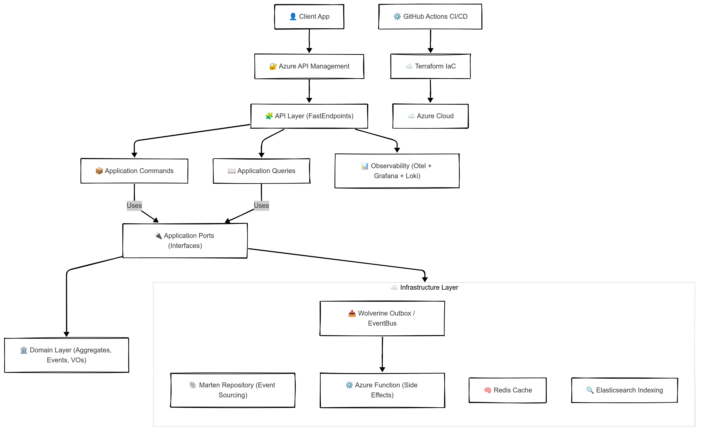

# TC Cloud Games - Microservices Solution

A modern cloud-native gaming platform built with microservices architecture, Azure infrastructure, and .NET Aspire orchestration.

## 🏗️ Architecture Overview

This solution follows a well-organized microservices architecture with clear separation of concerns:

```
tc-cloudgames-solution/
├── 🛠️ infrastructure/     # Infrastructure as Code
│   └── terraform/         # Terraform files (Azure Container Apps, Key Vault, etc.)
├── 🚀 orchestration/      # Development environment orchestration  
│   └── apphost/           # .NET Aspire AppHost for local development
├── 🎯 services/           # Business microservices
│   ├── users/             # User management, authentication & access control
│   ├── games/             # Game management, sessions & scoring
│   └── payments/          # Payments, transactions & credits
├── 🧱 shared/             # Shared components
│   └── common/            # Shared Kernel (contracts, events, utilities)
├── 🔄 .github/         # CI/CD automation
│   └── workflows/         # GitHub Actions workflows orchestrator
└── 📜 scripts/            # Solution automation scripts
    └── clone-repos.ps1    # Repository cloning script
```

## 🛠️ Architecture Diagram Overview

<div align="center">
  <a href="./docs/images/img_001_diagram.png" target="_blank">
    
  </a>
  <p><em>🔍 Click to enlarge</em></p>
</div>

## 🛠️ Architecture Overview
<div align="center">
  <a href="./docs/images/img_001_diagram.png" target="_blank" title="Click to view full-size architecture diagram">
    
  </a>
  <br>
  <em>🔍 Click to view full-size diagram</em>
</div>


## 📦 Repositories

| Repository | Alias | Category | Description |
|------------|-------|----------|-------------|
| `tc-cloudgames-solution` | `solution` | 🛠️ Infrastructure | Terraform IaC for Azure Container Apps, Key Vault, Managed Identity, ASB, ACR & GitHub Actions |
| `tc-cloudgames-apphost` | `apphost` | 🚀 Orchestration | .NET Aspire AppHost for local development environment orchestration |
| `tc-cloudgames-users` | `users` | 🎯 Services | User management microservice with authentication, access control & Event Sourcing |
| `tc-cloudgames-games` | `games` | 🎯 Services | Game management microservice for sessions, scoring & game flow logic |
| `tc-cloudgames-payments` | `payments` | 🎯 Services | Payment microservice for transactions, credits & financial provider integration |
| `tc-cloudgames-common` | `common` | 🧱 Shared | Shared Kernel with contracts, integration events & utilities  |


## 🧩 Component Matrix

| Repository | 🌐 Infra | ⚙️ AppHost | 👤 Users | 🎮 Games | 💳 Payments | ♻️ Shared | 🔁 CI/CD |
|------------|:--------:|:----------:|:--------:|:--------:|:-----------:|:--------:|:--------:|
| `tc-cloudgames-users` | | | ✅ | | | ✅ | ✅ |
| `tc-cloudgames-games` | | | | ✅ | | ✅ | ✅ |
| `tc-cloudgames-payments` | | | | | ✅ | ✅ | ✅ |
| `tc-cloudgames-common` | | | ✅ | ✅ | ✅ | ✅ | |
| `tc-cloudgames-pipelines` | ✅ | | | | | | ✅ |
| `tc-cloudgames-solution` | ✅ | ✅ | ✅ | ✅ | ✅ | ✅ | ✅ |

### 🧩 Legend
- 🌐 **Solution** – Resource provisioning, networking, Key Vault, identity management
- ⚙️ **AppHost** – Local orchestration with .NET Aspire
- 👤 **Users** – Authentication and identity microservice
- 🎮 **Games** – Game logic and session microservice
- 💳 **Payments** – Financial microservice
- ♻️ **Shared** – Reusable code and contracts between microservices
- 🔁 **CI/CD** – Automation and deployment workflows

## 🏛️ Architecture Patterns

### Hexagonal Architecture (Ports & Adapters)
Each microservice follows hexagonal architecture:
- **Domain Layer**: Core business logic and aggregates
- **Application Layer**: Use cases, commands, queries, and orchestration
- **Infrastructure Layer**: External concerns (database, messaging, APIs)
- **API Layer**: HTTP endpoints and controllers

### CQRS + Event Sourcing
- **Commands**: Write operations that modify state
- **Queries**: Read operations optimized for specific use cases
- **Events**: Domain events for audit trail and projections
- **Projections**: Materialized views for read models

### Database per Service
- Each microservice has its own dedicated database
- Complete data isolation between services
- Independent scalability and evolution

## 🎯 Microservices Overview

### 👤 Users Service
- **Responsibility**: User management, authentication, and access control
- **Database**: PostgreSQL (`users_db`)
- **Key Features**:
  - User registration and authentication
  - Role-based access control (RBAC)
  - Event Sourcing for audit trail
  - JWT token management

### 🎮 Games Service
- **Responsibility**: Game management, sessions, and scoring
- **Database**: PostgreSQL (`games_db`)
- **Key Features**:
  - Game catalog management
  - Advanced search with Elasticsearch
  - Game purchase workflow
  - User game library projections
  - Game session tracking

### 💳 Payments Service
- **Responsibility**: Financial transactions and payment processing
- **Database**: PostgreSQL (`payments_db`)
- **Key Features**:
  - Payment processing
  - Transaction management
  - Credit system
  - Integration with payment gateways
  - Financial reporting

## 🔧 Technology Stack

### Backend Framework
- **.NET 9**: Modern, high-performance framework
- **FastEndpoints**: Minimalist API endpoints with high performance
- **FluentValidation**: Comprehensive input validation

### Data & Storage
- **Marten**: Event Store and Document Database for PostgreSQL
- **PostgreSQL**: Primary database with dedicated schemas per service
- **Redis**: Distributed caching and session storage
- **Elasticsearch**: Advanced search and analytics

### Messaging & Communication
- **Wolverine**: Message broker with built-in CQRS support
- **Azure Service Bus**: Cloud messaging for production
- **RabbitMQ**: Local development messaging

### Infrastructure & DevOps
- **Azure**: Cloud platform and services
- **Terraform**: Infrastructure as Code
- **Docker**: Containerization
- **.NET Aspire**: Local development orchestration

### Observability & Monitoring
- **Serilog**: Structured logging framework
- **Grafana Loki**: Log aggregation and querying
- **Application Insights**: Application performance monitoring
- **Health Checks**: Service health monitoring


## 🚀 Quick Start

### Prerequisites

Before you begin, ensure you have the following installed:

- [.NET 9 SDK](https://dotnet.microsoft.com/en-us/download) - For building and running .NET applications
- [Docker Desktop](https://www.docker.com/) - For containerization
- [Terraform CLI](https://developer.hashicorp.com/terraform/downloads) - For infrastructure provisioning
- Azure subscription with appropriate permissions

### 1. Clone All Repositories

Use the provided PowerShell script to clone all repositories with organized folder structure:

```powershell
# Navigate to your development directory
cd C:\Projects

# Clone the solution repository
git clone https://github.com/rdpresser/tc-cloudgames-solution.git
cd tc-cloudgames-solution

# Run the automated cloning script
.\scripts\clone-repos.ps1
```

The script will create the following organized structure:
```
tc-cloudgames-solution/
├── infrastructure/terraform/
├── orchestration/apphost/
├── services/
│   ├── users/
│   ├── games/
│   └── payments/
├── shared/common/

```

### 2. Local Development with Aspire

```powershell
# Navigate to the AppHost project
cd orchestration/apphost

# Restore dependencies
dotnet restore

# Run the Aspire AppHost (starts all microservices locally)
dotnet run
```

This will start the Aspire dashboard and all configured microservices for local development.

### 3. Deploy to Azure

```powershell
# Navigate to infrastructure
cd infrastructure/terraform

# Initialize and deploy infrastructure
terraform init -upgrade
terraform plan
terraform apply -auto-approve
```

## 🛠️ Development Workflow

### Local Development
1. **Start dependencies**: Use Docker Compose or Dapr for external dependencies
2. **Run AppHost**: Execute the Aspire AppHost to orchestrate all microservices
3. **Develop**: Make changes to individual microservices
4. **Test**: Use the integrated testing approach with shared contracts

### CI/CD Pipeline
1. **Code changes**: Push to feature branches
2. **Automated testing**: GitHub Actions run tests and quality checks
3. **Infrastructure validation**: Terraform plans are validated
4. **Deployment**: Automatic deployment to staging/production environments

## 📚 Documentation

Each repository contains detailed documentation:

- **Infrastructure**: Terraform modules, Azure resource configuration
- **Services**: API documentation, domain models, event schemas
- **AppHost**: Local development setup, service configuration
- **Common**: Shared contracts, event definitions, utilities
- **Pipelines**: CI/CD workflow documentation

## 🔐 Security & Compliance

- **Authentication**: Azure Active Directory integration
- **Authorization**: Role-based access control (RBAC)
- **Secrets Management**: Azure Key Vault for sensitive data
- **Network Security**: Virtual networks, private endpoints
- **Monitoring**: Azure Application Insights, logging

## 🤝 Contributing

### Development Guidelines
1. **Branch Strategy**: Feature branches from `main`
2. **Commit Messages**: Follow conventional commit format
3. **Code Review**: All changes require peer review
4. **Testing**: Maintain test coverage above 80%

### Pull Request Process
1. Fork the repository
2. Create a feature branch (`git checkout -b feature/amazing-feature`)
3. Commit your changes (`git commit -m 'Add amazing feature'`)
4. Push to the branch (`git push origin feature/amazing-feature`)
5. Open a Pull Request with detailed description

### Code Standards
- **C#**: Follow Microsoft coding conventions
- **Architecture**: Maintain hexagonal architecture principles
- **Documentation**: Update documentation with code changes
- **Performance**: Consider performance implications

## 📊 Monitoring & Observability

### Application Insights
- **Performance Metrics**: Response times, throughput
- **Error Tracking**: Exception monitoring and alerting
- **Dependency Tracking**: External service calls

### Logging
- **Structured Logging**: JSON format with correlation IDs
- **Log Levels**: Appropriate logging levels per environment
- **Centralized Aggregation**: All logs in Grafana Loki

### Health Checks
- **Service Health**: Database connectivity, external services
- **Dependency Health**: Redis, Elasticsearch, message brokers
- **Custom Health Checks**: Business logic validation

## 📄 License

This project is licensed under the MIT License - see the individual repository LICENSE files for details.

## 📞 Support

For questions or issues:
- Open an [issue](https://github.com/rdpresser/tc-cloudgames-solution/issues) in this repository
- Check individual repository documentation
- Review the troubleshooting guides in each service

---

**TC Cloud Games** - Building the future of cloud gaming with modern microservices architecture.
