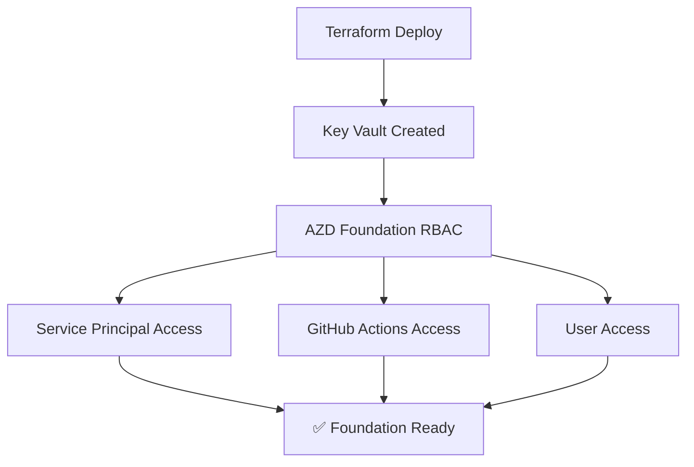
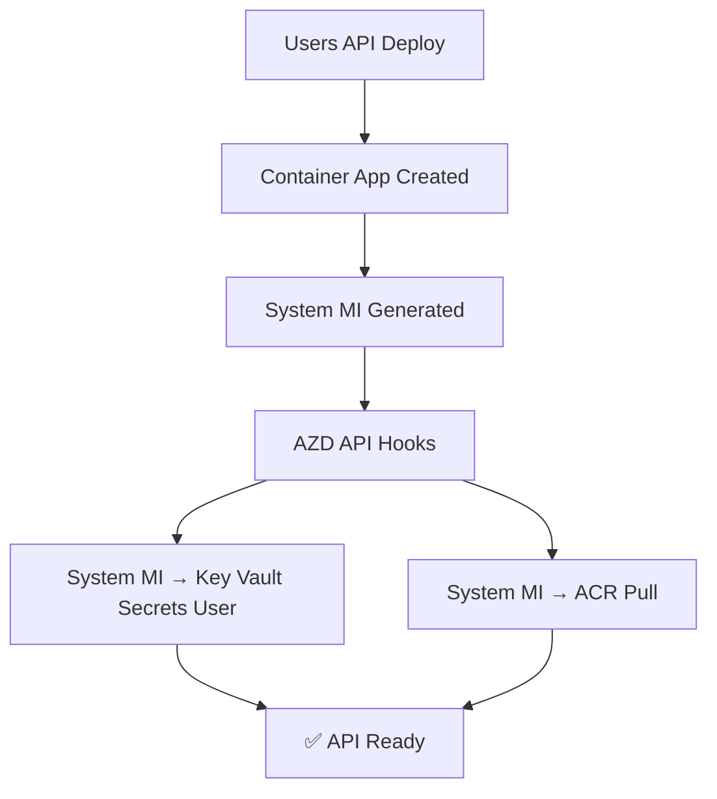

# TC CloudGames - RBAC Architecture

## 🏗️ **Centralized Foundation Approach** 

### **Foundation Level (✅ Implemented)**
```
infrastructure/azd/foundation/azd.yaml
├── 🔐 Key Vault RBAC Configuration
│   ├── Service Principal → Key Vault Administrator + Secrets User
│   ├── GitHub Actions → Key Vault Secrets User  
│   └── User Account → Key Vault Administrator
└── 📦 Pipeline Integration: .github/workflows/iac_deploy.yml
```

### **API Level (✅ Optimized)**
```
services/users/azd/azure.yaml
├── 🎯 Container App System MI → Key Vault Secrets User
├── 🎯 Container App System MI → ACR Pull
└── 📝 Note: Foundation handles Service Principal RBAC
```

---

## 🔄 **RBAC Flow Architecture**

### **1. Foundation Deployment**


### **2. API Deployment**


---

## 🎯 **Benefits of Centralized Approach**

### ✅ **Eliminates Duplication**
- **Before**: Each API (users, games, payments) had identical RBAC hooks
- **After**: Single Foundation-level RBAC configuration

### ✅ **Better Separation of Concerns**  
- **Foundation**: Shared resource access (Service Principal, GitHub Actions)
- **APIs**: Application-specific access (Container App System MI)

### ✅ **Simplified Maintenance**
- **Single source of truth** for Key Vault Service Principal RBAC
- **Consistent permissions** across all microservices

---

## 📋 **RBAC Matrix**

| Principal Type | Resource | Role | Scope | Managed By |
|----------------|----------|------|-------|------------|
| Service Principal | Key Vault | Administrator | Vault | Foundation |
| Service Principal | Key Vault | Secrets User | Vault | Foundation |
| GitHub Actions SP | Key Vault | Secrets User | Vault | Foundation |
| User Account | Key Vault | Administrator | Vault | Foundation |
| Container App MI | Key Vault | Secrets User | Vault | API |
| Container App MI | ACR | Pull | Registry | API |

---

## 🚀 **Deployment Sequence**

1. **Foundation Pipeline** (.github/workflows/iac_deploy.yml)
   - Terraform creates infrastructure  
   - AZD Foundation configures shared RBAC

2. **API Pipeline** (.github/workflows/users_api_deploy.yml)
   - AZD deploys Container App
   - Configures application-specific RBAC

3. **Result**: Complete microservices architecture with centralized foundation!

---

## 🔍 **File Structure**

```
tc-cloudgames-solution/
├── infrastructure/
│   ├── azd/foundation/azd.yaml           # 🔐 Foundation RBAC
│   └── terraform/modules/key_vault/      # 🏗️ Infrastructure
├── .github/workflows/
│   ├── iac_deploy.yml                    # 🚀 Foundation Pipeline + RBAC
│   └── users_api_deploy.yml              # 🚀 API Pipeline
└── services/users/azd/azure.yaml        # 🎯 API-specific RBAC only
```

---

## ✨ **Next Steps**

1. **Games API**: Replicate same approach (Foundation + API-specific RBAC)
2. **Payments API**: Replicate same approach  
3. **Validation**: Test complete end-to-end flow
4. **Documentation**: Update deployment guides

🏆 **Architecture Status**: **Optimized & Production-Ready!**
