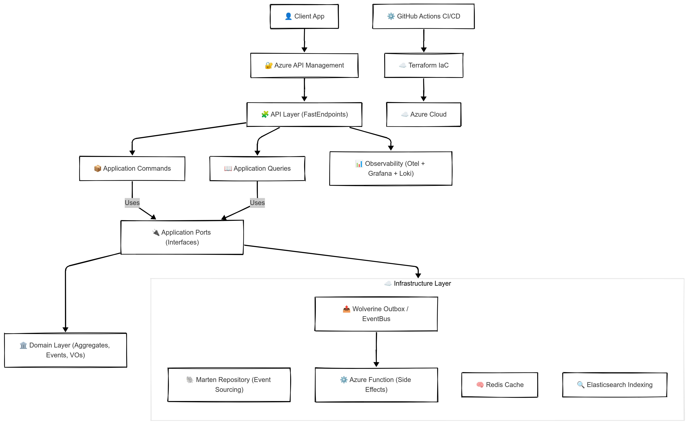
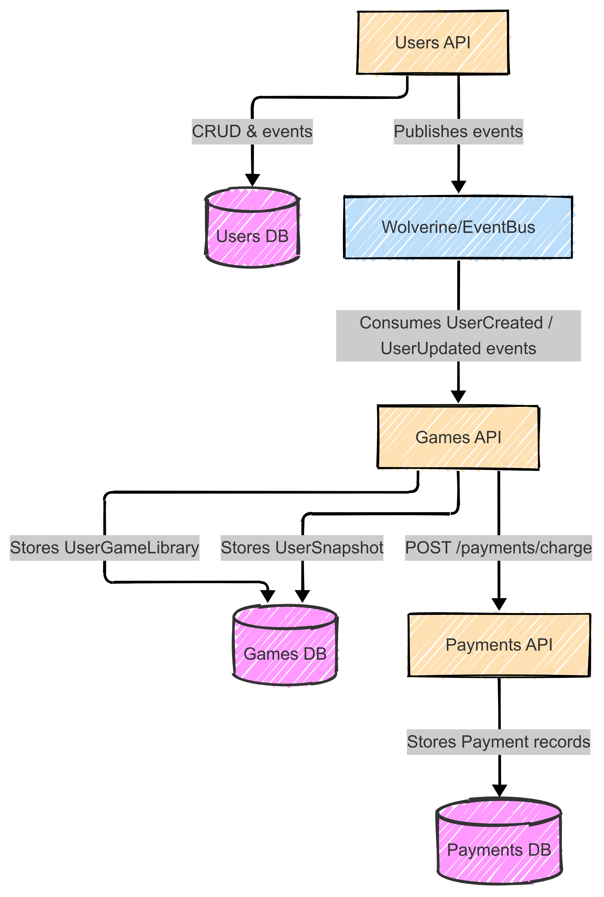
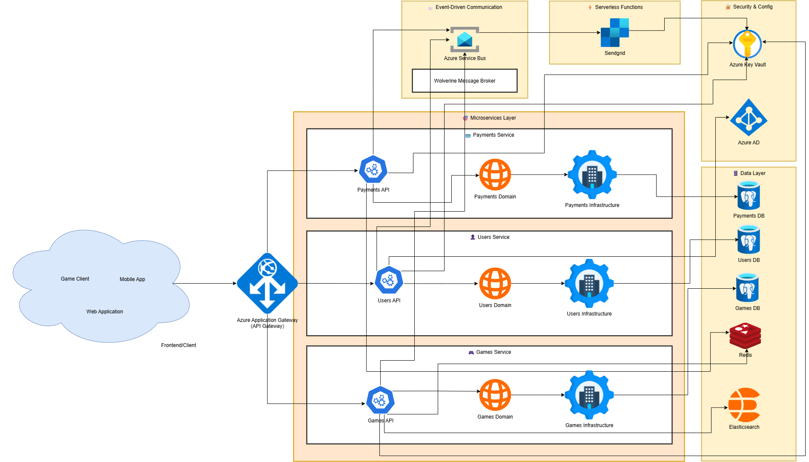
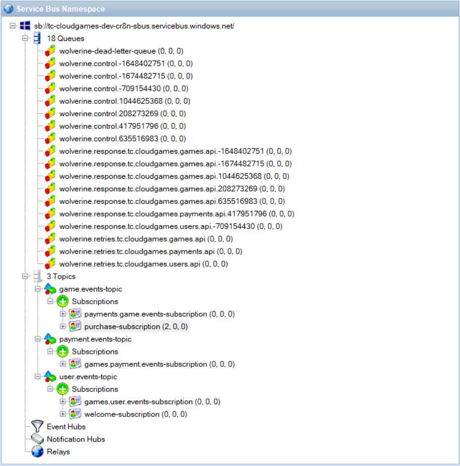

# 🎬 ROTEIRO PARA VÍDEO TÉCNICO - PHASE_04

Com base no projeto TC Cloud Games (phase_04), cobrindo Terraform, AKS/Kubernetes, k6, PostgreSQL, Redis, Marten com Event Sourcing, Wolverine com Outbox Pattern.

---

## 📋 PARTE 1 — ROTEIRO EM BULLET POINTS (15 minutos)

- **Abertura (1-2 min)**
  - Projeto e contexto acadêmico; objetivo da Phase_04; visão geral da arquitetura.
- **Arquitetura & Padrões (3-4 min)**
  - Hexagonal + DDD; Microservices (Users, Games, Payments); Event-Driven; CQRS + Event Sourcing.
- **Infra como Código (3-4 min)**
  - Terraform (15+ recursos Azure); AKS produção; segurança (Workload Identity + External Secrets); GitOps (ArgoCD bootstrap).
- **Mensageria & Integração (2-3 min)**
  - Wolverine + Outbox Pattern; Azure Service Bus tópicos; Integration Events; Saga de compra.
- **Performance & Otimização (2-3 min)**
  - k6 smoke/load/performance; resultados (20k+ req, 0% falhas); otimização recursos (700Mi -> 512Mi); auto-scaling.
- **Encerramento (1 min)**
  - Conquistas da Phase_04; lições aprendidas; próximos passos.

---

## 📖 PARTE 2 — ROTEIRO DETALHADO COM EXPLICAÇÕES

### 🎯 1. Abertura (1-2 min)
- Slide: "TC Cloud Games - Phase_04: Production Kubernetes Deployment".
- Contexto: Plataforma de distribuição digital de jogos (estilo Steam/Epic) em arquitetura cloud-native.
- Números rápidos:
  - 3 microservices; 15+ recursos Azure via Terraform.
  - 20.651 requisições com 0% falhas no load test (Games); P95 194ms.
  - Deploy automatizado via GitOps (ArgoCD); zero credenciais hardcoded (Workload Identity + ESO).
- Stack visual: .NET 9 + FastEndpoints | PostgreSQL + Marten | Redis | Service Bus + Wolverine | AKS | Terraform | ArgoCD | k6.

### 🏗️ 2. Arquitetura & Padrões (3-4 min)
- Hexagonal Architecture (Ports & Adapters) com DDD tático.
- Estrutura por serviço (Users, Games, Payments): Core/Domain (Aggregates, Value Objects, Domain Events) + Application (Commands/Queries, Handlers) + Adapters (API FastEndpoints, Marten, Redis, Service Bus).
- CQRS + Event Sourcing (Users): Event Store em PostgreSQL via Marten; replay/time-travel; projeções para leitura.
- DDD: Aggregates (User, Game, Payment), Value Objects (Email, Price), Domain Events (UserRegistered, PaymentApproved).
- Referência visual: 

### ☁️ 3. Infraestrutura como Código (3-4 min)
- Terraform módulos (infrastructure/terraform/modules/): aks_cluster, container_registry, postgres, redis, service_bus, key_vault, virtual_network, log_analytics, application_insights, external_secrets, nginx_ingress, argocd.
- AKS produção: autoscaling 2-6 nodes (Standard_D2s_v3), Workload Identity habilitado, Log Analytics.
- Segurança: zero credenciais; External Secrets Operator + Key Vault; RBAC mínimo; TLS no Ingress.
- GitOps (ArgoCD bootstrap): app-of-apps instala WI webhook, ingress-nginx, ESO, e aplica user/games/payments com Deployment+Service+Ingress+ExternalSecret+HPA+PDB.
- Ilustração draw.io: docs/tc-cloudgames-aks-architecture.drawio (exporte para PNG se quiser atualizar).

### 📨 4. Mensageria & Integração (2-3 min)
- Wolverine + Outbox Pattern (Marten) garantindo entrega transacional.
- Azure Service Bus tópicos e filtros SQL; Dead Letter para retries.
- Saga de compra:
  1) Games publica GamePurchaseRequestedIntegrationEvent
  2) Payments processa e publica PaymentApproved/Failed
  3) Games atualiza biblioteca do usuário ou compensa
- Fluxos visuais: 
  - Mensageria: 
  - Communication Flow: 
  - Service Bus: 

### 📊 5. Performance & Otimização (2-3 min)
- k6 suites:
  - Smoke: 1 VU, 30s (sanity pré-deploy)
  - Load: 25 VUs, 9m (ramp 10->25->0)
  - Performance: 50-100 VUs, 15m (stress)
- Resultados (Games load): 20.651 req, 0% falhas, P95 194ms, 38 req/s.
- Otimização: requests de memória 700Mi -> 512Mi (-27%); limits 1800Mi -> 1400Mi; densidade +50%; HPA funcional (2-5 réplicas).
- Comando exemplo (timestamped):
```powershell
$ts = Get-Date -Format "yyyyMMdd_HHmmss"
k6 run k6/load/games-load.js --summary-export="k6/output/games-load_$ts.json"
```

### 🧠 6. Encerramento (1 min)
- Conquistas Phase_04:
  - AKS produção com GitOps; zero credenciais; ESO + KV.
  - Outbox + Saga; CQRS + Event Sourcing; HA (2+ réplicas) + HPA + PDB.
  - Performance: P95 194ms; auto-scaling validado; custo otimizado (-27% memória requisitada).
- Lições: decisões guiadas por métricas (k6 + kubectl top); segurança desde o início (WI/ESO); confiança em deploys (ArgoCD rollback).
- Próximos passos: Network Policies, PSS, chaos engineering, multi-region, service mesh.

---

## 🖼️ Referências Visuais
- Arquitetura AKS (atual): docs/images/img_001_diagram.png
- Fluxo mensageria: docs/images/message_broker_flow.png
- Comunicação microservices: docs/images/microservices-communication-flow.png
- Topologia Service Bus: docs/images/servicebus_queues.png
- Fonte editável: docs/tc-cloudgames-aks-architecture.drawio (exportar para PNG se precisar)

---

## ⚙️ Comandos Úteis (demo rápida)
```powershell
# k6 smoke/load/perf
k6 run k6/smoke/users-smoke.js
k6 run k6/load/games-load.js --summary-export="k6/output/games-load_$(Get-Date -Format 'yyyyMMdd_HHmmss').json"

# Terraform (exemplo genérico)
cd infrastructure/terraform/foundation
terraform init
terraform plan

# ArgoCD (após kubeconfig)
argocd app list
argocd app sync cloudgames-prod
```

---

## 🎥 Dicas de Gravação (tempo sugerido)
- Abertura: 1:30
- Arquitetura & Padrões: 3:30
- Infra: 3:30
- Mensageria: 2:30
- Performance: 3:00
- Encerramento: 1:00
- Total: ~15 minutos

Use as imagens da pasta docs/images e o draw.io para apoiar os trechos visuais.
