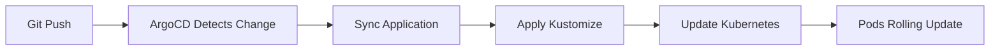

# ☸️ TC CloudGames - Kubernetes Infrastructure

> Production-ready Kubernetes infrastructure with **GitOps (ArgoCD)**, **External Secrets (Azure Key Vault)**, and **Workload Identity**

---

## 📚 Quick Navigation

| Environment | Description | Documentation |
|-------------|-------------|---------------|
| **☁️ Production (AKS)** | Azure Kubernetes Service | [AKS Production Guide](scripts/prod/README.md) |
| **🔧 Local Development** | K3D cluster with native Ingress | [K3D Development](#-k3d-local-development) |

**Key Documents:**
- 🏗️ [AKS Architecture](scripts/prod/ARCHITECTURE.md) - Production architecture and patterns
- 🔐 [Security Investigation](INVESTIGATION_OUTOFSYNC_RESOLUTION.md) - Deep dive into security implementation

---

## 📂 Project Structure

```
infrastructure/kubernetes/
├── 📁 base/                          # Kustomize base configurations
│   ├── common/                       # Shared resources (ClusterSecretStore, ConfigMaps)
│   ├── games/                        # Games API deployment + ExternalSecret
│   ├── payments/                     # Payments API deployment + ExternalSecret
│   └── user/                         # User API deployment + ExternalSecret
│
├── 📁 overlays/                      # Environment-specific overlays
│   ├── dev/                          # K3D local development patches
│   └── prod/                         # AKS production patches (HPA, PDB, Workload Identity)
│
├── 📁 manifests/                     # ArgoCD Application definitions
│   ├── application-bootstrap.yaml    # Meta-app (manages all apps via GitOps)
│   ├── application-cloudgames-prod.yaml
│   ├── application-azure-workload-identity.yaml
│   ├── application-external-secrets.yaml
│   └── application-ingress-nginx.yaml
│
└── 📁 scripts/                       # Management scripts
    ├── dev/                          # K3D scripts (k3d-manager.ps1)
    └── prod/                         # AKS scripts (aks-manager.ps1) - See prod/README.md
```

### Key Concepts

| Component | Purpose | Location |
|-----------|---------|----------|
| **Base** | Core Kubernetes manifests (Deployments, Services, ExternalSecrets) | `base/{service}/` |
| **Overlays** | Environment-specific patches (HPA, PDB, resource limits) | `overlays/{env}/` |
| **Manifests** | ArgoCD Applications (GitOps definitions) | `manifests/` |
| **Scripts** | Automation tools (aks-manager.ps1, k3d-manager.ps1) | `scripts/{env}/` |

---

## 🚀 Production (AKS) Quick Start

### Prerequisites
- Azure CLI authenticated
- kubectl installed
- PowerShell 7+

### Step 1: Connect to AKS
```powershell
cd infrastructure\kubernetes\scripts\prod
.\aks-manager.ps1 connect
```

### Step 2: Bootstrap Infrastructure (First Time Only)
```powershell
# Menu-driven (recommended)
.\aks-manager.ps1
# Select: [12] Post-Terraform Complete Setup

# Or via CLI
.\aks-manager.ps1 post-terraform-setup
```

**What it does:**
1. Installs ArgoCD (GitOps controller)
2. Configures External Secrets Operator with Workload Identity
3. Sets up ArgoCD Image Updater (automated image updates)
4. Bootstraps all applications (bootstrap → platform → apps)
5. Verifies cluster health

### Step 3: Verify Deployment
```powershell
.\aks-manager.ps1 status

# Or manually
kubectl get applications -n argocd
kubectl get pods -n cloudgames
kubectl get externalsecrets -n cloudgames
```

**Expected output:**
```
✅ ArgoCD: 5/5 Applications Synced
✅ Pods: 12/12 Running (4 replicas each: user, games, payments)
✅ ExternalSecrets: 3/3 SecretSynced
✅ Ingresses: 3/3 Configured
```

---

## 🛡️ Security Architecture

### Multi-Layer Defense

```
Azure Key Vault (Source of Truth)
    ↓ Workload Identity (no credentials)
External Secrets Operator
    ↓ Dynamic sync (1h refresh)
Kubernetes Secrets (Opaque)
    ↓ envFrom
Application Pods (least privilege ServiceAccounts)
```

### Implemented Security Controls

| Control | Status | Implementation |
|---------|--------|----------------|
| **Secrets Management** | ✅ | Azure Key Vault + External Secrets Operator |
| **Zero Credentials** | ✅ | Workload Identity (Managed Identity) |
| **GitOps** | ✅ | ArgoCD with bootstrap pattern |
| **Namespace Isolation** | ✅ | Dedicated ServiceAccounts per API |
| **Least Privilege** | ✅ | ServiceAccounts with ZERO RBAC permissions |
| **Network Policies** | ⚪ | Future work |
| **Pod Security Standards** | ⚪ | Future work |
| **etcd Encryption (KMS)** | ⚪ | Not implemented (see [KMS_MIGRATION_PLAN.md](../KMS_MIGRATION_PLAN.md)) |

### Service Accounts Permissions
```bash
# Verified: All ServiceAccounts have minimal permissions
user-api-sa: ❌ Cannot list secrets, ❌ Cannot delete resources
games-api-sa: ❌ Cannot list secrets, ❌ Cannot delete resources
payments-api-sa: ❌ Cannot list secrets, ❌ Cannot delete resources
```

**Principle**: Least privilege by default. All secrets access is mediated via Azure Key Vault + Workload Identity.

---

## 🔧 AKS Manager Tool

Central orchestration tool for AKS cluster management. Located at `scripts/prod/aks-manager.ps1`.

### Core Commands

```powershell
# Interactive menu (recommended)
.\aks-manager.ps1

# Cluster connection
.\aks-manager.ps1 connect              # Get AKS credentials
.\aks-manager.ps1 status               # Show cluster health

# First-time setup
.\aks-manager.ps1 post-terraform-setup # Complete infrastructure bootstrap

# Component management
.\aks-manager.ps1 install-argocd       # Install ArgoCD
.\aks-manager.ps1 setup-eso-wi         # Configure External Secrets + Workload Identity
.\aks-manager.ps1 bootstrap            # Deploy all applications

# Troubleshooting
.\aks-manager.ps1 diagnose-fix-components  # Auto-detect and fix issues
.\aks-manager.ps1 fix-argocd-sync          # Recover ArgoCD sync problems
```

**Full documentation**: [scripts/prod/README.md](scripts/prod/README.md)

---

## 📦 Application Deployment Flow

### GitOps with ArgoCD



### Bootstrap Pattern

```
application-bootstrap.yaml (Meta-app)
    ├── application-azure-workload-identity.yaml
    ├── application-ingress-nginx.yaml
    ├── application-external-secrets.yaml
    └── application-cloudgames-prod.yaml
            ├── user-api (Deployment + ExternalSecret + HPA + PDB + Ingress)
            ├── games-api (Deployment + ExternalSecret + HPA + PDB + Ingress)
            └── payments-api (Deployment + ExternalSecret + HPA + PDB + Ingress)
```

**Benefits:**
- ✅ Single source of truth (Git)
- ✅ Declarative infrastructure
- ✅ Automatic drift detection
- ✅ Self-healing (auto-sync enabled)

---

## 🔐 External Secrets Integration

### How It Works

```yaml
# 1. ClusterSecretStore (base/common/cluster-secret-store.yaml)
apiVersion: external-secrets.io/v1
kind: ClusterSecretStore
metadata:
  name: azure-keyvault
spec:
  provider:
    azurekv:
      authType: WorkloadIdentity  # No credentials!
      vaultUrl: https://tccloudgamesdevcr8nkv.vault.azure.net

---
# 2. ExternalSecret (base/user/external-secret.yaml)
apiVersion: external-secrets.io/v1
kind: ExternalSecret
metadata:
  name: user-api-secrets
spec:
  secretStoreRef:
    kind: ClusterSecretStore
    name: azure-keyvault
  data:
    - secretKey: DB_PASSWORD
      remoteRef:
        key: db-password  # From Azure Key Vault

---
# 3. Kubernetes Secret (auto-created)
apiVersion: v1
kind: Secret
metadata:
  name: user-api-secrets
data:
  DB_PASSWORD: <base64-encoded>  # Synced from Key Vault
```

**Refresh interval**: 1 hour (automatic sync)

---

## 🎯 Cluster Configuration (Production)

| Component | Configuration |
|-----------|---------------|
| **Cluster** | tc-cloudgames-dev-cr8n-aks |
| **Kubernetes Version** | 1.34.1 |
| **Node Pool** | nodepool1 (autoscaling: 1-5 nodes) |
| **VM Size** | Standard_D2s_v3 (2 vCPU, 8GB RAM) |
| **Network** | Azure CNI + VNet integration |
| **Identity** | System Assigned Managed Identity + Workload Identity |
| **Monitoring** | Azure Monitor + Container Insights |

### Workloads

| Service | Replicas | HPA | PDB | Resources |
|---------|----------|-----|-----|-----------|
| **user-api** | 4 (2-10) | ✅ | ✅ | 200m CPU / 256Mi RAM |
| **games-api** | 4 (2-10) | ✅ | ✅ | 200m CPU / 256Mi RAM |
| **payments-api** | 4 (2-10) | ✅ | ✅ | 200m CPU / 256Mi RAM |

**HPA Triggers**: 70% CPU / 80% Memory  
**PDB**: minAvailable=2 (high availability)

---

## 🧪 Testing & Validation

### Health Checks
```powershell
# Get LoadBalancer IP
$ip = kubectl get svc ingress-nginx-controller -n ingress-nginx -o jsonpath='{.status.loadBalancer.ingress[0].ip}'

# Test APIs
Invoke-WebRequest "http://$ip/user/health"
Invoke-WebRequest "http://$ip/games/health"
Invoke-WebRequest "http://$ip/payments/health"
```

### Verify Secrets
```powershell
# Check ExternalSecrets status
kubectl get externalsecrets -n cloudgames

# Verify secrets created
kubectl get secrets -n cloudgames | Select-String "api-secrets"

# Test secret content (careful!)
kubectl get secret user-api-secrets -n cloudgames -o jsonpath='{.data.DB_HOST}' | 
  ForEach-Object { [System.Text.Encoding]::UTF8.GetString([System.Convert]::FromBase64String($_)) }
```

### ArgoCD Applications
```powershell
kubectl get applications -n argocd

# Expected:
# azure-workload-identity     Synced   Healthy
# bootstrap                   Synced   Healthy
# cloudgames-prod             Synced   Healthy
# external-secrets-operator   Synced   Healthy
# ingress-nginx               Synced   Healthy
```

---

# 🚀 K3D Local Development

> Complete local Kubernetes development environment with **native Ingress support** - no port-forward needed!

## ⚡ Quick Start

```powershell
cd infrastructure\kubernetes\scripts\dev

# Interactive menu
.\k3d-manager.ps1

# Or direct commands
.\k3d-manager.ps1 create              # Create cluster
.\k3d-manager.ps1 update-hosts        # Add DNS entries (run as Admin)
.\k3d-manager.ps1 external-secrets    # Configure ESO
.\k3d-manager.ps1 bootstrap           # Deploy apps
```

## ✨ Native Ingress Access

**One-time setup (requires Administrator):**
```powershell
.\k3d-manager.ps1 update-hosts
```

**Service URLs:**
- ArgoCD: http://argocd.local (admin / Argo@123)
- User API: http://cloudgames.local/user
- Games API: http://cloudgames.local/games
- Payments API: http://cloudgames.local/payments

**Port-forward only needed for:**
- Grafana: `.\k3d-manager.ps1 port-forward grafana` → http://localhost:3000
- Headlamp: `.\k3d-manager.ps1 headlamp` → http://localhost:4466

---

## 🛠️ Troubleshooting

### Common Issues

| Problem | Solution |
|---------|----------|
| After reboot cluster doesn't work | `.\k3d-manager.ps1 start` |
| Port already in use | `.\k3d-manager.ps1 stop all` |
| ExternalSecrets not syncing | Check Azure credentials in ClusterSecretStore |
| ArgoCD apps stuck | `.\k3d-manager.ps1 reset-argocd-app <name>` |

### Logs & Diagnostics
```powershell
# Component logs
kubectl logs -n argocd -l app.kubernetes.io/name=argocd-server
kubectl logs -n external-secrets -l app.kubernetes.io/name=external-secrets
kubectl logs -n cloudgames-dev -l app=user-api

# Network diagnostics
.\k3d-manager.ps1 check
```

---

## 📋 Key Differences: K3D vs AKS

| Feature | K3D (Dev) | AKS (Prod) |
|---------|-----------|------------|
| **Secrets** | Azure Key Vault (same) | Azure Key Vault (same) |
| **Identity** | Service Principal | Workload Identity |
| **Ingress** | Traefik + local DNS | NGINX + Azure LB |
| **HPA/PDB** | Disabled | Enabled |
| **Replicas** | 1 per service | 4 per service (autoscaling) |
| **Registry** | localhost:5000 | Azure Container Registry |

---

## 💡 Tips

### PowerShell Alias
```powershell
# Add to $PROFILE
Set-Alias k3d "C:\Projects\tc-cloudgames-solution\infrastructure\kubernetes\scripts\dev\k3d-manager.ps1"

# Usage
k3d status
k3d port-forward grafana
```

### Build & Deploy Workflow
```powershell
# Build images
docker build -t user-api:dev -f services\users\src\Adapters\Inbound\TC.CloudGames.Users.Api\Dockerfile .

# Tag for registry
docker tag user-api:dev localhost:5000/user-api:dev

# Push
docker push localhost:5000/user-api:dev

# Restart deployment
kubectl rollout restart deployment user-api -n cloudgames-dev
```

---

## 📝 Important Notes

1. **Always use k3d-manager.ps1** as the main entry point
2. **Hosts file required** for ArgoCD and API access (run update-hosts as Admin)
3. **External Secrets** syncs from Azure Key Vault (same as production)
4. **Port-forward** only needed for Grafana and Headlamp
5. **Scripts are idempotent** - safe to run multiple times
6. **Native Ingress** - No port-forward needed for APIs!

---
